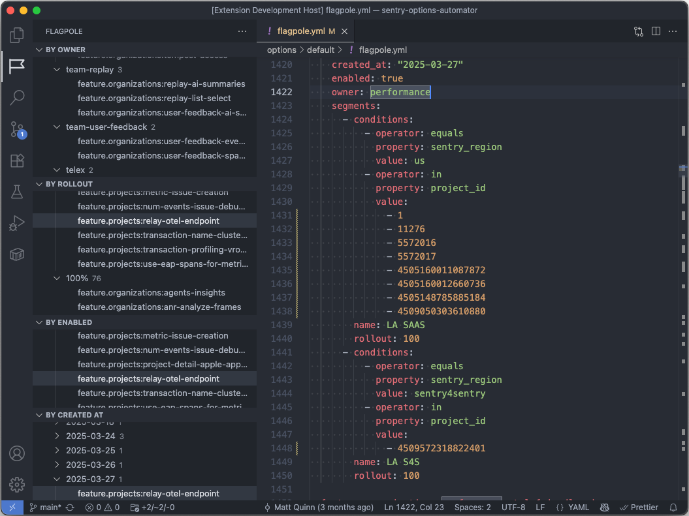

# Sentry Flagpole Explorer

A VSCode/Cursor/etc extension to aid in navigating & reading Sentry's internal feature flag definitions.

## 🚀 Installation

You can install the latest version of Flagpole Explorer from the Visual Studio Marketplace

 - https://marketplace.visualstudio.com/items?itemName=getsentry.flagpole-explorer
 - https://open-vsx.org/extension/getsentry/flagpole-explorer

If you're dealing with Flagpole inside Sentry, then the extension is already part of the recommended list for the repo.

## 🐛 Bugs

Please file an issue [here](https://github.com/getsentry/vscode-flagpole-explorer/issues) for feature requests, bugs, missing documentation, or unexpected behavior.

Pull Requests are welcome and encouraged!

## 🖥️ Developing

Development processes can all be accomplished through the VSCode UI.

1. Open the "Run and Debug" view in the sidebar. (`SHIFT + CMD + D`)
2. Click the green "play" button at the top (`F5`), with "Run Extension" selected in the dropdown next to it.
3. A new window will open, with the extension loaded for your debugging
    - Select the 'Flagpole' flag icon in the sidebar to activate the extension and load the views
    - Open the `sentry-options-automator` repo to see something in the extension's tree views!

Notice the 'Debug Console' in the host window. Any `console.log` messages from the extension will be printed here. You can also set breakpoints in your code inside TypeScript files like `src/extension.ts` to debug.

The extension will rebuild in the background as you edit files, but the debug window will not reload to show changes.
To reload the debug window with the latest build of the extension run 'Developer: Reload Window' (`CTRL + OPT + CMD + L`) from the command palette.

## Publishing

New versions will be automatically published into the Visual Studio Marketplace via the Github Actions CI pipeline.

Releases are also tracked in Sentry and Github. 

Publishing depends on a few security tokens:
- [Create Sentry Releases with `vscode-flagpole-explorer-gh-publish-action`](https://sentry.sentry.io/settings/auth-tokens/581410/)
- [Publish to Visual Studio Marketplace with `vscode-flagpole-explorer-publish-token`](https://dev.azure.com/ecosystem-member-1/_usersSettings/tokens)
    This token has a 1 year expiration, and will need to be rotated.
    Scopes: `Extensions=Read & Manage` & `Marketplace=Publish`
- Publsh to OVSX Registry
## License

[MIT ©](https://github.com/getsentry/cookie-sync/blob/main/LICENCE)
