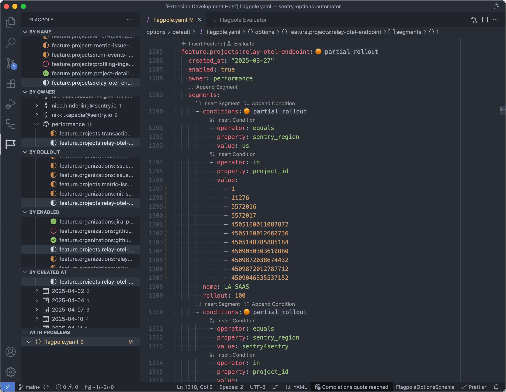
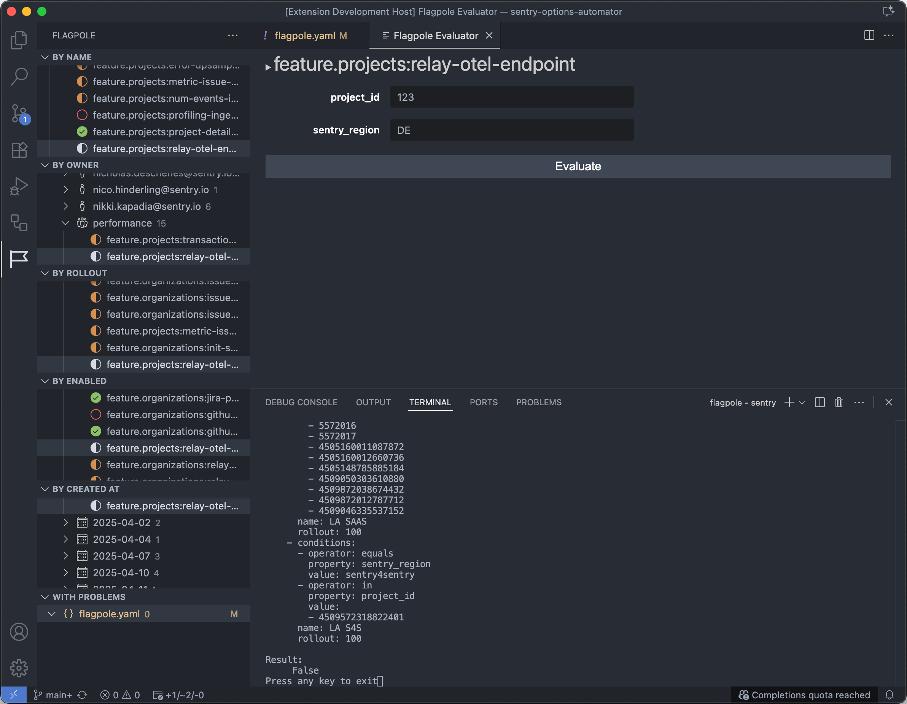

# Sentry Flagpole Explorer

A VSCode/Cursor/etc extension to aid in navigating & editing Sentry's internal feature flag definitions.

## 🚀 Installation

You can install the latest version of Flagpole Explorer from the Visual Studio Marketplace

 - https://marketplace.visualstudio.com/items?itemName=getsentry.flagpole-explorer
 - https://open-vsx.org/extension/getsentry/flagpole-explorer

If you're dealing with Flagpole inside Sentry, then the extension is already part of the recommended list for the repo.

## ✨ Features

- In the Activity bar you can view the 'Flagpole' view which contains:
    - Multiple tree views to navigate flags by: Name, Owner, Rollout state, Enabled true/false, Created At Date
    - There's also a tree view that lists flags which have problems detected within them. For example, flags where a segment is listed after a no-condition 'GA' segment.
    
- Within the editor's text area you'll notice
    - Icons to indicate the rollout status of a flag
    - Icons to indicate the rollout status of a given segment within a flag
    - Buttons to make it easier to insert or append new flags/segments/conditions within the existing file
    - A button to 'Evaluate' a flag. Test conditions offline before committing your change

- Colors/Icons are used to indicate flags that are:
    - Green: fully rolled out, at least one segment has no conditions, the flag is true for all.
    - Orange: partially rolled out, segments have conditions or their rollout percent is not 100
    - Red: not enabled, the flag has `enabled:false` or no segments are rolled out

## 🖼️ Screenshots

## 📊 Diagnostics

This extension sends diagnostic data (error reports and performance metrics) to Sentry to help us identify and fix issues. No sensitive data or file contents are transmitted.

**To opt out**: Open Settings and uncheck `flagpole-explorer.allowSendingDiagnostics`

See [SENTRY_SETUP.md](./SENTRY_SETUP.md) for more details about what data is collected and how to disable it.

## 🐛 Bugs

Please file an issue [here](https://github.com/getsentry/vscode-flagpole-explorer/issues) for feature requests, bugs, missing documentation, or unexpected behavior.

Pull Requests are welcome and encouraged!

## 🖥️ Developing

Development processes can all be accomplished through the VSCode UI.

1. Open the "Run and Debug" view in the sidebar. (`SHIFT + CMD + D`)
2. Click the green "play" button at the top (`F5`), with "Run Extension" selected in the dropdown next to it.
3. A new window will open, with the extension loaded for your debugging
    - Select the 'Flagpole' flag icon in the sidebar to activate the extension and load the views
    - Open the `sentry-options-automator` repo to see something in the extension's tree views!

Notice the 'Debug Console' in the host window. Any `console.log` messages from the extension will be printed here. You can also set breakpoints in your code inside TypeScript files like `src/extension.ts` to debug.

The extension will rebuild in the background as you edit files, but the debug window will not reload to show changes.
To reload the debug window with the latest build of the extension run 'Developer: Reload Window' (`CTRL + OPT + CMD + L`) from the command palette.

You can [debug webviews](https://code.visualstudio.com/api/extension-guides/webview#inspecting-and-debugging-webviews) as well (such as the Evalutate Feature view). From within the window that contains the running extenion, run the command 'Developer: Open Webview Developer Tools' from the command palette to open a chrome devtools instance where you can find the iframe for your webview.

## Publishing

New versions will be automatically published into the Visual Studio Marketplace via the Github Actions CI pipeline.

Releases are also tracked in Sentry and Github. 

Publishing depends on a few security tokens:
- [Create Sentry Releases with `vscode-flagpole-explorer-gh-publish-action`](https://sentry.sentry.io/settings/auth-tokens/581410/)
- [Publish to Visual Studio Marketplace with `vscode-flagpole-explorer-publish-token`](https://dev.azure.com/ecosystem-member-1/_usersSettings/tokens)
    This token has a 1 year expiration, and will need to be rotated.
    Scopes: `Extensions=Read & Manage` & `Marketplace=Publish`
- Publsh to OVSX Registry

## License

[MIT ©](https://github.com/getsentry/vscode-flagpole-explorer/blob/main/LICENSE)
